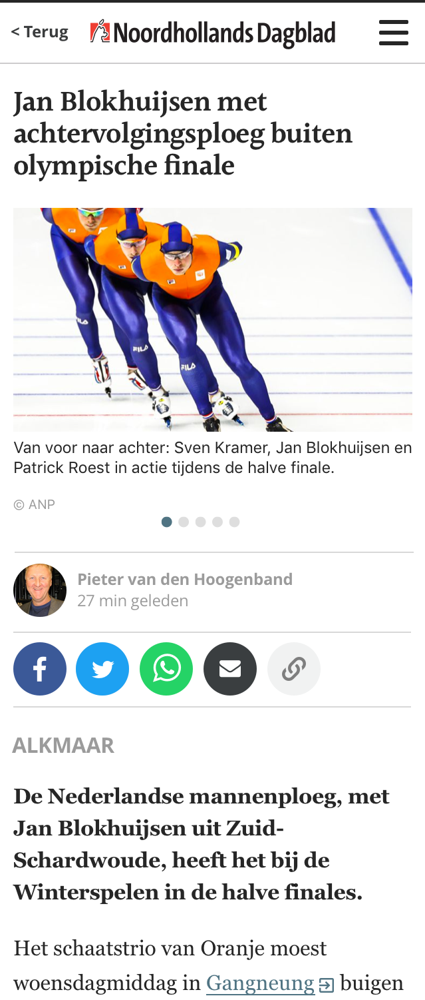

# Exercise: frontend developer

> When you are finished with your version, please host this somewhere on Github and share your link

This is an exercise to test your knowledge of **HTML**, **CSS** and **JavaScript**. You shouldn't spend more than 3 hours on it. If you don't finish the exercise before the set time that's not a problem as long as you can write down why and how you would finish the exercise.

Don't worry to much about the code you produce, there is **no correct solution**. We will have a chat about this exercise anyway so you'll have time to talk about the shortcuts you made.

- [Introduction](#introduction)
- [Specifications](#specifications)
- [Technical details](#technical-details)
- [Design details](#design-details)

## Introduction

Because we are news company you'll be working on the mobile site of one of our brands.

The general idea of the task will be to develop a single article page that enables you to:

- read the main article content; e.g: heading, introduction, body text, ...
- navigate between images with the help of an image slider
- link to popular social media services, email and clipboard via the displayed icons
- navigate to other sections of the website via a hamburger menu displayed at the top right

More info on the [technical details](#technical-details) and the [design details](#design-details) can be found in the respective sections. The next section is all about the [specifications](#specifications).

## Specifications

### Image slider

The image slider must contain a set of 5 images. By default only the first image is loaded. The other images are loaded on demand. The active state must be communicated via a dotted pagination.
View the [mockup](#mockup) for visual reference.

### Action icons

The set of 5 action items (positioned between date and label) must link to their respective services. It's ok to include dummy actions for Facebook, Twitter, Whatsapp and Email. Do try to craft a fully functional copy to clipboard action. When clicked the page url should be copied to the clipboard and ready to paste.

View the [mockup](#mockup) for visual reference.

### Hamburger menu

The hamburger menu in top right corner of the UI should open a navigation drawer that slides in from the left of the page. The content and the styling of the drawer are not important. It's ok to fill it with dummy content. Focus on getting the interaction right.

An example of the intended interaction can be found at: https://codepen.io/Fjellyman/full/LGQdwM

View the [mockup](#mockup) for visual reference.

## Technical details

The master branch can be used as a starter kit for the project. Cloning it and running `yarn` and `yarn start` should present you with a ready-to-go application.

**Note**: the package.json includes a predefined set of dependencies. **Feel free to add or remove packages** as needed. Use as many open source components as you like. Update the webpack.config.js if you need to. Use _CSS_, _Sass_ or _CSS Modules_; whatever you like.

### Prerequisites

This exercise requires [Node](https://nodejs.org/en/) >= 10 and [Yarn](https://yarnpkg.com/lang/en/) >= 1.19.2

### Install

```bash
yarn
```

### Build

The build command will bundle all assets and output a static version of the website in the _build_ folder:

```bash
yarn build
```

### Develop

The develop command will serve and watch changes to the website:

```bash
yarn develop
```

or

```bash
yarn start
```

## Design details

### Colors

UI colors:

- Brand: #507483
- Black: #000000
- White: #fffff
- Grey: #9b9b9b

Action colors:

- Facebook: #3b5998
- Twitter: #1da1f2
- Whatsapp: #25d366
- Email: #3a3e40
- Clipboard: #d2d5d6

**Note**: we're counting on your creativity to fill in the gaps for the hover, focus and active states

### Typography

- Heading: 600 22px/1.15 Halant
- Caption: 400 12px/1.45 Open Sans
- Author: 700 12px/1.45 Open Sans
- Date: 400 12px/1.45 Open Sans
- Label: 700 16px/1.45 Open Sans
- Introduction: 700 16px/1.5 Georgia
- Body: 400 16px/1.625 Georgia

**Note**: all fonts are included in the _src_ folder

### Iconography

Use your favorite open source icons or create custom ones. You'll need the following icons:

- hamburger
- facebook
- twitter
- whatsapp
- email
- copy to clipboard

**Note**: the logo and favicon are included in the _public_ folder

### Mockup


